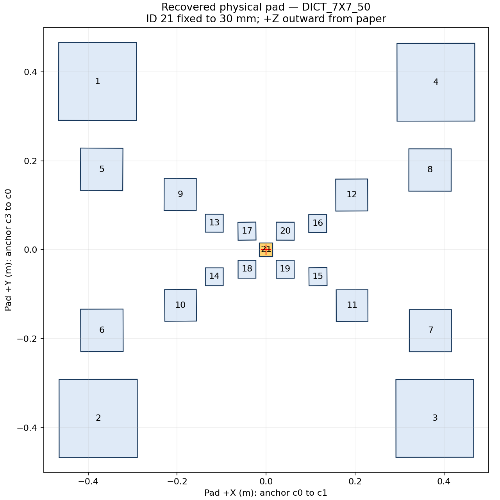
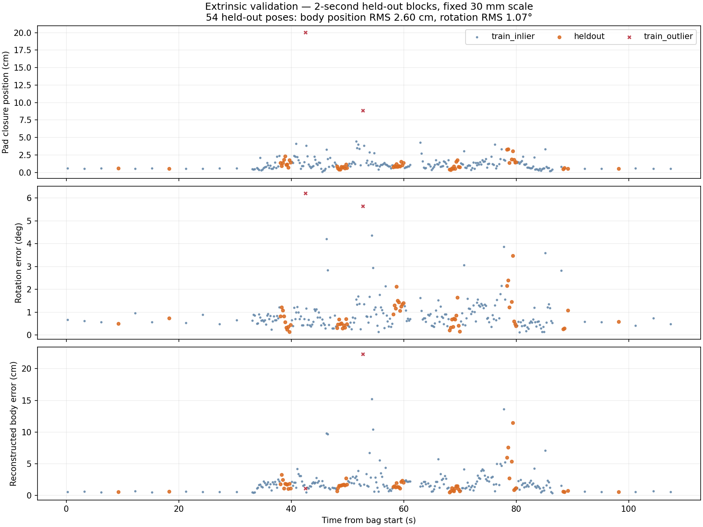
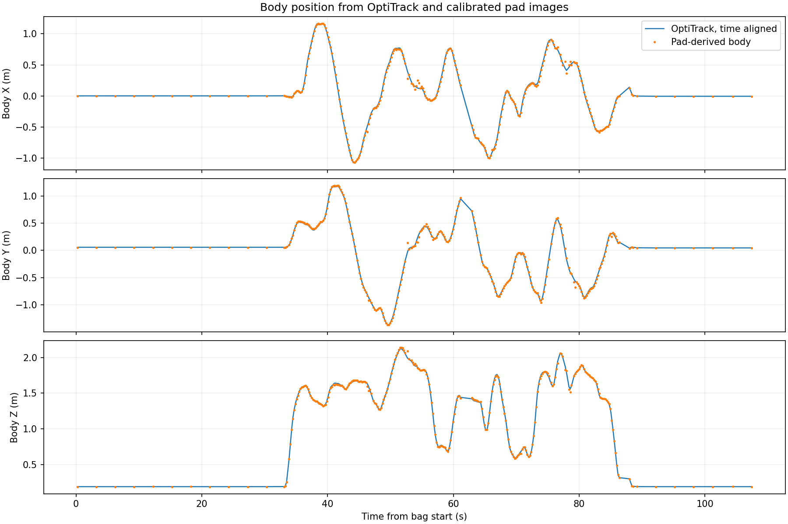

# Physical pad and joint extrinsic calibration — 2026-09-19

The recorded hand-carried session yields an **offline calibration PASS** for
`A(t + dt) X Z(t) = Y`, with X=body-from-camera and Y=OptiTrack-from-pad.
This is a held-out calibration result, not live-estimator or PX4 transition validation.

## Measurements and coordinate conventions

- Bag: `experiments/aruco-landing/camera-body-extrinsic/extrinsic-pad-anchor30mm-01_2026-09-19-10-14-42.bag`.
- Duration 109.381 s; 6,502 original RGB frames, 6,503 CameraInfo, 10,904 body poses.
- Camera: See3CAM serial `1A3958060A020900`, 1280×720, original distorted RGB.
- Intrinsic: colleague's final 2026-09-15 YAML. Recorded CameraInfo K/D and resolution match the solver input.
- The user's selected upper-center marker is **DICT_7X7_50 ID 21**, not ID 7.
  The reference pattern matched ID 21 with zero bit errors. Its black-square side
  is fixed to the user-supplied **0.030 m**. This is the metric-scale assumption;
  no independent dimensional survey was performed.
- P origin: ID 21 center. +X from decoded c0 to c1; +Y from c3 to c0;
  +Z outward from paper. In the initial reference image +X points roughly down
  and +Y roughly right. This is not an automatically inferred flight heading.
- G: OptiTrack message frame `odom`. B: Motive `pure`, interpreted as the
  configured body-center FLU `base_link`. C: `see3cam_optical_frame`.
- `T_A_B` maps B coordinates into A. Quaternion order is **x,y,z,w**.

## Solved transforms

Files are in [config/calibration/20260919](../../config/calibration/20260919).

| Transform | Translation x, y, z (m) | Quaternion x, y, z, w |
| --- | --- | --- |
| X = T_body_camera | 0.001396685, -0.122546316, 0.000099326 | 0.999818741, -0.011972292, 0.008307570, 0.012252869 |
| Y = T_odom_pad | 0.001016004, -0.034598269, -0.002823331 | -0.001912705, -0.013827086, -0.700134682, 0.713874344 |

The camera optical center is about 12.25 cm toward body -Y from the Motive body
origin. Use the full quaternion, not a rounded 180-degree mounting assumption.
X remains reusable only while the camera mounting and Motive body definition
remain fixed. Y describes the pad placement during this particular bag.

The fitted time convention is:

```text
body measurement time = image.header.stamp - 0.041589317 seconds
```

This is an effective relative measurement delay estimated from motion; it may
include exposure, capture/timestamp and transport behavior. It is not an
independent measurement of clock offset. Webcam/click synchronization can
provide an independent check later. The timing YAML is saved; runtime stamping
has not been changed in this calibration task.

## Held-out validation

Every fifth 2-second block is held out from both map reconstruction and
extrinsic fitting. Of 546 image samples, 526 produced accepted planar board
poses. Diverse image/body pair selection yielded 216 training and 54 held-out
poses; two training residual outliers were removed, leaving 214 training poses.
Twenty-seven abrupt OptiTrack pose steps between 61.64 and 62.58 s were detected; image
pairs within 0.25 s were excluded before splitting/fitting. All remaining
held-out residuals are reported, including the worst cases.

| Metric | Training inliers (214) | Held out (54) |
| --- | --- | --- |
| AXZY pad-origin closure position RMS | 1.480 cm | **1.314 cm** |
| Orientation RMS | 1.093° | **1.066°** |
| Reconstructed body-origin position RMS | 2.845 cm | **2.603 cm** |
| Reconstructed body-origin position p95 | 4.987 cm | **5.538 cm** |
| Reconstructed body-origin position maximum | 15.226 cm | **11.455 cm** |

With at least three fully accepted markers, 52 held-out poses have body
position RMS 2.320 cm and p95 2.939 cm; the maximum remains 11.455 cm.
Low image reprojection error alone is insufficient to guarantee body pose
accuracy. Live source switching still needs temporal consistency, freshness,
marker/geometry quality and discontinuity checks.

The two position metrics differ because angular error acts over the distance
between body and pad. The body-origin metric is the relevant one for the
future estimation source transition.

Map reconstruction used 160 training images and 1,137 marker observations;
9 observations were rejected. Inlier reprojection RMS is 1.047 px. All IDs
1–21 have recovered centers, side lengths and in-plane angles. Approximate
side lengths: IDs 1–4: 17.5 cm; 5–8: 9.5 cm; 9–12: 7.2 cm; 13–20: 4.0 cm;
21: fixed 3.0 cm. Per-marker fitted values are in the manifest.

Thirty training time-block bootstrap fits, holding intrinsic and map fixed,
give body-camera translation component standard deviations of 1.21, 1.74,
3.11 mm; rotation-vector component standard deviations of 0.065°, 0.081°,
0.114°; time-offset standard deviation 1.31 ms. These conditional estimates
exclude errors in the supplied 30 mm scale, intrinsic and reconstructed map.







## Reuse and reproduction

- `base_link_to_see3cam_optical_frame.yaml`: X, full matrix and quaternion.
- Y is retained as a diagnostic value in this report only; no runtime placement YAML.
- `see3cam_optical_frame_to_base_link_check.yaml`: inverse X for direction checks.
- `physical_landing_pad_DICT_7X7_50.yaml`: metric map, anchor and frame definition.
- `physical_pad_estimator_layout.yaml`: existing C++ estimator layout encoding;
  use **dictionary=DICT_7X7_50, pad_size_m=1.0**. The 1-unit canvas is a coordinate
  encoding, not a measured pad boundary. Geometry round-trip was checked.
- `body_camera_static_tf.launch`: opt-in measured X publisher, not started here.
  Ensure an old provisional body-camera publisher is stopped before use.
- `time_alignment.yaml`: fitted relative timing, not automatically applied.

The runtime estimator uses per-marker fusion, while this offline solver fits
both planar hypotheses using the full board. Its live accuracy must therefore
be checked separately. The subsequent physical-pad runtime uses full-board PnP;
see [online estimator](../../docs/physical_pad_estimator.md). Camera, recorder and estimator deployment defaults were
not changed by this solve. No MAVROS/PX4 source switching was performed.

On ML, using `/usr/bin/python3` (OpenCV 4.13 with the ArUcoDetector API, NumPy,
SciPy 1.10, PyYAML and ROS Noetic rosbag):

```bash
source /opt/ros/noetic/setup.bash
BAG=experiments/aruco-landing/camera-body-extrinsic/extrinsic-pad-anchor30mm-01_2026-09-19-10-14-42.bag
OUT=experiments/aruco-landing/camera-body-extrinsic/calibration-20260919
INTR=modules/sensor/see3cam-24cug/calibration/1A3958060A020900.yaml
POSES=experiments/aruco-landing/camera-body-extrinsic/extrinsic-pad-anchor30mm-01_2026-09-19-10-14-42.body_poses.npz
/usr/bin/python3 stack-assets/aruco-landing-jetson/tools/calibrate_pad_extrinsics.py extract \
  --bag "$BAG" --intrinsic "$INTR" --output "$OUT"
OPENBLAS_NUM_THREADS=1 /usr/bin/python3 stack-assets/aruco-landing-jetson/tools/calibrate_pad_extrinsics.py solve \
  --intrinsic "$INTR" --poses "$POSES" --output "$OUT"
OPENBLAS_NUM_THREADS=1 /usr/bin/python3 stack-assets/aruco-landing-jetson/tests/test_calibrate_pad_extrinsics.py
```

The synthetic end-to-end test uses known X/Y, a 37 ms delay, epoch-scale ROS
timestamps, independent smooth body motion and noisy distorted pixel corners.
It recovers the mounting transform and delay within the asserted limits and
checks held-out reconstructed body error. The recorded data's full per-frame
detections, camera poses and original sampled PNGs remain in the experiment
folder. SHA-256 input provenance is recorded in `provenance.json`.
