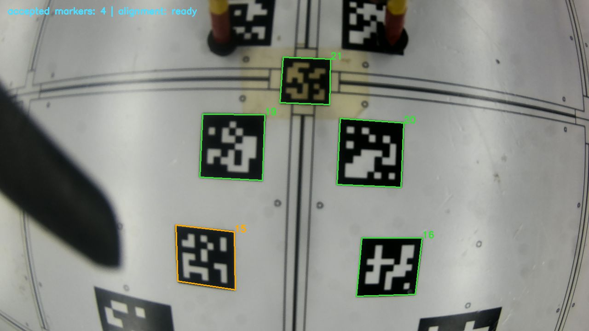

# Jetson physical-estimator validation

The physical pad detector/body converter/session alignment node was tested on
the Jetson inside its existing ROS Docker, using an isolated master at port
11321. Camera hardware, live OptiTrack and MAVROS were not driven by the replay.

- Full 109.38 s recorded image/CameraInfo/pose replay: 6,404 processed images,
  5,972 pad-body messages, 5,889 global marker-body messages.
- OptiTrack forwarding was deliberately stopped at 70 s. After a further
  one-second guard, **2,038 marker-derived global-body poses** continued using
  the learned in-memory pad placement.
- Annotated JPEG video ran at **9.96 Hz**, showing IDs and accepted/rejected
  marker outlines. Raw annotated image publication is separately demand-driven.
- Final optimized 20 s test with a static recorded image supplied at 60 Hz:
  after the first five seconds, **pad-body 60.00 Hz**, **global-body 60.00 Hz**,
  **annotated JPEG 9.98 Hz**. Last-window processing mean **10.61 ms**, p95
  **11.57 ms**, below the 16.67 ms frame budget.
- Of the 1,200 static input frames, 1,173 were processed; startup/online-learning
  did drop some frames. A latest-frame queue prevents these becoming delayed
  control measurements. Steady 60 Hz on this input does not guarantee 60 Hz
  for every view/load. Occluded/invalid marker frames intentionally yield no pose.
- Reset returned success, cleared the learned alignment and sample buffer, and
  published ready=false. Fresh startup has no saved global-pad transform to load.
- Six ML unit tests passed, including full-board planar pose/mount direction,
  covariance lever arm, interpolation gap/jump rejection, learning, OptiTrack
  loss and re-learning a moved pad. Four new core tests also passed on Jetson's
  older OpenCV 4.2.0 bindings.

The replay used the initial three-window detector. Final throughput uses two
threshold windows (7, 27), two OpenCV threads and subscriber-driven auxiliary
outputs. On 109 sampled bag frames, both window choices yielded 103 qualified
poses. Tests do not establish absolute live pose accuracy or validate PX4
source switching. See `validation.json` for machine-readable evidence and the
[estimator guide](../../docs/physical_pad_estimator.md) for topics and execution.

