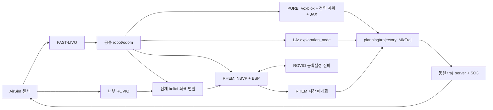

# PURE / LA / RHEM AirSim 비교 실행

이 프로필은 `ModernLivingroom_long`에서 사용했던 PURE/LA 비교 조건을 복원한다.
기본 hardware/AirSim 설정과 현재 `ws/risk-aware` 소스는 그대로 두고,
`ws/risk-aware-comparison`의 고정 리비전으로 공통 실행 체인을 구성한다.
RHEM은 `ws/rhem`의 별도 catkin workspace를 사용한다.

2026-09-21 현재 세 planner의 연결과 짧은 비행은 확인했다. **RHEM의 추적 안정성은
완료 판정하지 않았다.** 비행 후 VIO/GT/최종 명령 위치의 큰 차이가 관찰되어
`rhem-end-state.json`에 남겼다. 공통 estimator/controller를 바꾸거나 GT 제어로 전환해
이 차이를 감추지 않는다. 이 통합은 원본 조건에서 후속 원인 분석을 할 수 있는 실행 기반이다.

## 복원 근거와 한계

원본 ROS 파라미터는 다음 데이터에서 읽었다.

```text
/home/ml/.local/share/Trash/files/risk-aware_planning/src/mav_active_3d_planning/active_3d_planning_app_reconstruction/data/
  cvar_n10_2026-07-06_14-01-12/iter_1/rosparams.yaml
  la_n20ext_2026-07-07_01-53-04/iter_1/rosparams.yaml
```

`pure_n20_merged/iter_1`의 예전 절대경로 심볼릭 링크를 따라가는 대신 실제 원본을 찾았다.
두 기록의 `system`, `planning`, `target_bounding_volume`, `map_bounding_volume`은
LA의 일시적인 `feature_warmup_done` 상태를 제외하면 같다.
이 네 영역을 `config/comparison-20260706-params.yaml`로 복원했다.
추가로 센서·카메라 외부 파라미터·FAST-LIVO·SO(3)의 공통 18개 영역을
`config/comparison-20260706-sensors.yaml`에 보존했다. 실행 시 원본과 대조했으며,
기존 실행의 사용하지 않는 compressed-depth PNG 압축 레벨 차이(1 대 9)도 복원 프로필에는 9로 저장했다.

원본 기록에는 소스 커밋과 Python 내부 JAX 설정이 없다. 따라서 코드까지 동일했던
실행이라고 단정할 수 없다. PURE CVaR 설정과 Gen-B 체크포인트를 지원하고 이후
auxiliary-mean correction이 들어가기 전인 `7f84116dc1a5f45e0f61573eee8b6ca357abfde0`을
**복원 리비전**으로 명시했다. 기존 모델 `best_val.pth`와 `kinetic_statistics.pt`의
해시는 프로필에 고정했다. Voxblox용 VFE는 같은 체크포인트에서 다시 내보냈다.
당시 사용한 traced 파일과 바이트가 같다는 의미는 아니다.

| 공통 항목 | 복원 값 |
|---|---|
| Unreal 패키지 / 맵 | `test9_vio_velocity` / `/Game/ModernLivingRoom/Maps/Main_long` |
| 위치 추정 / 계획 odometry | FAST-LIVO, `localization=vio`, `/robot/odom` |
| 좌표계 | `odom`, body `aft_mapped` |
| 시작 위치 / yaw | `(2, 1, 1.5)` m / `0` |
| 영상 / 깊이 / IMU | `/camera/left/image_raw`, `/camera/depth/image_raw`, `/airsim_node/hmcl/imu/imu` |
| 카메라 정보 / 점군 | `/camera/left/camera_info`, `/voxel_grid/output` |
| voxel / sensor range | `0.25 m` / `5 m` |
| 속도 xy / z | `2 / 1 m/s` |
| 가속도 xy / z / yaw | `5 / 2 m/s²`, `5 rad/s²` |
| yaw rate / 제어 주기 | `2 rad/s`, `50 Hz` |
| 기존 재계획 파라미터 | `replan_time=0.045`, `replan_out=2.0` |
| 계획 영역 xyz | `[-23,7] × [-3,8] × [0,2] m` |

`use_vio_for_control=false`도 원본 값으로 보존한다. 실제로 선택한 공통 SO(3) 소스는
`/system/odom_topic`을 읽으므로 `/robot/odom`을 사용한다. 파라미터 이름만 보고 GT
제어라고 판단하지 않는다. 새로운 기본 설정의 위험 가중치 0을 이 프로필에 섞지 않는다.

## 실제 실행되는 파일과 연결

아래 경로 중 `risk_aware_planning/` 이하는 모두 **comparison workspace** 기준이다.

| 역할 | 실제 실행 경로 |
|---|---|
| 공통 센서 | `active_3d_planning_app_reconstruction/launch/airsim_sensor_punlisher.launch` |
| 위치 추정 | `modules/odometry/fast-livo/run.sh` → AirSim FAST-LIVO profile |
| PURE 지도 | `active_3d_planning_app_reconstruction/launch/uncertainty_voxblox.launch` |
| PURE 전역 계획 | 같은 패키지의 `exploration_planner.launch` → `planner_node` |
| PURE 지역 계획 | `mav_active_3d_planning/local_planner_mpc/jax_main_node_ros_new.py` |
| PURE 궤적 변환 | `local_controller/scripts/jax_to_mixtraj.py` |
| LA | `modules/planner/la-planner/run.sh` → `la_planner_bridge/launch/la_planner_airsim.launch` → `exploration_node` |
| RHEM | `modules/planner/rhem/launch/rhem.launch` → `bsp_planner`, `rovio_node`, `rovio_bsp_node`, `belief_bridge.py` |
| RHEM 궤적 변환 | `stacks/sim-x86/scripts/rhem_control_adapter.py`, `rhem_trajectory.py` |
| 공통 궤적 실행 | `la_planner/local_plan_manager/src/traj_server.cpp` |
| 공통 제어 | `local_controller/scripts/so3_control_bridge.py`, `ours_so3_stack.launch` |



한 번에 하나의 planner만 실행한다. RHEM 실행에는 PURE의 Voxblox/JAX를 띄우지 않는다.
RHEM의 OctoMap과 LA의 지도는 각 알고리즘 내부 구성이다. 센서 입력과 공통 제어 체인은 같다.

LA는 별도 capability와 실행 진입점을 갖는다. 소스 저장소 및 controller/messages는
`planner/risk-aware`와 공유한다. PURE도 LA 트리의 `traj_server`를 사용하므로 해당
디렉터리를 물리적으로 옮기지 않았다. 독립된 LA 소스 저장소로 분리한 것은 아니다.

## RHEM 통합 규약

`modules/planner/rhem/sources.yml`이 모든 저장소의 커밋과 패치를 고정한다.
사용자가 갖고 있던 `/home/ml/rhem_planner`의 로컬 수정도 패치에 보존하며 원본은 편집하지 않는다.
`clone.sh`는 기존 소스가 예상 커밋과 다르면 덮어쓰지 않는다.

ROVIO는 내부 belief 계산만 맡는다. 공통 odometry나 제어 토픽을 대체하지 않는다.
`belief_bridge.py`는 시간상 가까운 FAST-LIVO pose로 ROVIO world를 정렬한다.
랜드마크와 전체 공분산의 위치·자세 블록 및 교차 공분산을 함께 회전하며,
ROVIO의 passive quaternion 규약을 적용한다. 이 구성은 `NPOSE=0`을 요구한다.
유효 특징점 0, 오래된 상태, timestamp 불일치, 잘못된 covariance에는 서비스가 실패한다.

카메라 내부 파라미터와 외부 변환은 실행 중인 CameraInfo/TF에서 가져온다.
공통 센서의 기존 외부 파라미터를 따로 수정하지 않는다. 생성된 설정은 `.build/sim-x86/rhem/`에만 쓴다.
공통 속도·가속도·yaw 한계, 영역, voxel, 최대 관측거리를 RHEM에 전달한다.
RHEM 고유 gain, tree iteration, belief dynamics, robot bounding-box 설정은 원본 로컬 설정을 유지한다.

추가 패치는 Noetic/OpenCV/시스템 Eigen·glog·gflags 빌드 호환성을 처리하고 다음을 교정한다.

- BSP 충돌 검사를 부모→새 정점 구간에 적용한다. 원본은 새 정점→다음 구간을 검사했다.
- 첫 belief propagation 요청부터 OctoMap을 포함한다.
- 전파 서비스 실패/비정상 uncertainty 값을 유효한 후보로 쓰지 않는다.
- 공통 world frame을 전달하고, 결과 계산에 사용하지 않던 별도 TF 조회를 제거한다.
- 내부 가상 전파 TF 방송과 tracker GUI를 끌 수 있게 한다.
- 전파 요청의 전체 초기 상태를 도착 검사 전에 적용해 이전 후보 상태가 재사용되지 않게 한다.
- `bsp_srv` 응답에 `belief_space`, `belief_improved`를 추가해 유효한 불확실성 평가와 개선 경로 선택을 구분한다.

원본 RHEM은 불확실성을 평가한 결과 더 나은 경로가 없으면 기존 직선 경로를 유지한다.
이 정상 동작을 보존하며, `belief_space=true`는 직접 경로의 uncertainty 전파가 유효했음을 뜻한다.
`belief_improved=true`는 더 낮은 uncertainty를 가진 대체 경로가 선택됐음을 별도로 나타낸다.
전파 자체가 없거나 실패한 결과는 AirSim adapter가 실행하지 않는다.
경로는 각 선분을 그대로 따라가는 5차 궤적으로 변환한다. 정점에서 속도·가속도를 0으로
만들어 모서리를 가로지르지 않는다. 이것은 공통 제어기에 맞춘 시간 매개화이며,
원본 RHEM의 MAVROS 실행기를 재현한 것은 아니다.
재계획은 정점 도착·정지 이후 수행하므로 기존 PURE/LA와 계산 주기까지 같다는 뜻은 아니다.

## 준비와 실행

기존 sim-x86 이미지/FAST-LIVO/risk-aware workspace가 준비된 상태에서:

```bash
# 새로운 환경은 기존 setup.sh clone/build/up/build-ws 절차로 기본 스택을 먼저 준비한다.
bash modules/planner/rhem/clone.sh
python3 stacks/sim-x86/scripts/prepare_comparison.py
bash stacks/sim-x86/scripts/build_comparison.sh
docker exec drone-stack-sim-x86 bash /work/modules/planner/rhem/build_ws.sh
```

새 이미지의 apt 의존성은 RHEM `module.yml`에서 생성된다. 기존 컨테이너를 재사용하면
해당 의존성 설치가 필요하다. 이번 검증은 기존 이미지에 의존성을 추가한 컨테이너에서 수행했다.
이미지 전체를 새로 빌드했다는 의미는 아니다.

호스트에서 기존 roscore, 동일 TEST9 Unreal 패키지, AirSim ROS bridge를 실행한다.
각 장기 실행 명령은 별도 터미널에서 사용한다.

```bash
# 호스트 ROS 터미널의 공통 환경
source /opt/ros/noetic/setup.bash
source config/sim.env
source config/ros_env.sh

# 호스트 터미널 1
roscore -p 11311

# 호스트 터미널 2: config/sim.env를 source한 후
cd "$UE_PACKAGED_ROOT/test9_vio_velocity/LinuxNoEditor/MyFirstUE4/Binaries/Linux"
DISPLAY=:0 ./MyFirstUE4 -settings="$AIRSIM_SETTINGS_DIR/settings.json"

# 호스트 터미널 3: 위 공통 ROS 환경을 source한 후
source "$AIRSIM_ROOT/ros/devel/setup.bash"
roslaunch airsim_ros_pkgs airsim_node.launch
```

```bash
bash stacks/sim-x86/scripts/run_comparison.sh config
bash stacks/sim-x86/scripts/run_comparison.sh sensor
bash stacks/sim-x86/scripts/run_comparison.sh initialize
# estimator/planner/control을 시작하기 전, 별도 터미널:
bash stacks/sim-x86/scripts/run_comparison.sh reset
./setup.sh run sim-x86 odometry/fast-livo
bash stacks/sim-x86/scripts/run_comparison.sh control
```

`reset`은 planner/control/FAST-LIVO가 켜져 있으면 거부한다. 드론을 기준 pose로 옮긴 뒤
잔여 속도를 0으로 초기화하고, 기존 초기화 노드와 같은 world-velocity P 제어로
위치·yaw·속도가 3초 동안 안정되는지 확인한다. 기존 초기화 노드의 이동 플래그와
텔레포트 직후 조기 반환 때문에 생기는 반복 실행 차이를 이 절차에서 처리한다.
완료 후 곧바로 FAST-LIVO를 시작한다. 오랜 대기 중에는 기존 zero-velocity hover의
작은 고도 변화가 누적될 수 있으며, 검증기는 시작 위치가 기준에서 0.25 m 넘게 벗어나면 비행을 거부한다.
모든 프로그램을 동시에 켜면 초기화 전 `(0,0,0)` odometry가
나올 수 있으므로 첫 정상 odometry와 feature 발행을 확인한다.

계획기 선택:

```bash
# PURE: 세 터미널
bash stacks/sim-x86/scripts/run_comparison.sh voxblox
bash stacks/sim-x86/scripts/run_comparison.sh pure-global
bash stacks/sim-x86/scripts/run_comparison.sh pure-local

# LA: 한 터미널
bash stacks/sim-x86/scripts/run_comparison.sh la

# RHEM: 한 터미널; 시작 시 비행/계획 비활성
bash stacks/sim-x86/scripts/run_rhem.sh
```

짧은 실제 비행 검증은 선택한 planner에 대해 실행한다.

```bash
bash stacks/sim-x86/scripts/run_comparison.sh validate \
  --planner rhem --fly --seconds 15 --timeout 90 \
  --output /work/flight_logs/comparison/rhem-smoke.json
```

PURE/LA는 `--planner pure` 또는 `--planner la`를 사용한다. 검증기는 실제 메시지와
GT 위치 변화를 확인하고, 종료 시 SO(3) 명령을 끄고 초기화 노드의 hover를 복구한다.
RHEM은 추가로 유효 특징점, 유한한 전파 uncertainty, BSP 선택 및 해당 궤적 전달을 요구한다.
직접 경로 유지와 개선 경로 선택은 모두 평가된 RHEM 결과이며, 단순 NBVP-only 실행은 제외한다.
`--fly`가 없으면 비행을 활성화하지 않고 메시지만 검사한다.

수동 RHEM 비행 시작은 컨테이너의 ROS 환경에서 다음 순서로 한다.

```bash
rosservice call /control_bridge/toggle_running 'data: true'
rosservice call /rhem/rhem_control_adapter/toggle_running 'data: true'
```

SO(3)는 활성화 이후 **새 trajectory ID**를 기다리며, 인계가 완료되면 hover를 해제한다.
정지는 RHEM planning을 false로 바꾸고 control을 false로 바꾼다.
planner를 바꿀 때 이전 planner와 공통 control, FAST-LIVO를 종료하고 `reset`부터 반복한다.

## 검증 범위

| 단계 | 결과 |
|---|---|
| 복원 workspace | 15개 패키지 빌드 및 VFE checkpoint 일치 검사 통과 |
| RHEM workspace | 15개 패키지 빌드 통과 |
| PURE / LA | 각각 15초 메시지 체인·이동 검사 통과 |
| RHEM | 기준 GT `(2,1,1.487)`에서 시작, 20회 유효 전파, 평가된 궤적 1개 전달 및 15초 이동 확인 |
| ROVIO 전파 회귀 검사 | 3개 연속 무이동 요청의 상태·공분산 보존; 0.25m 후보의 예측 종점 오차 0.028m |
| 궤적·belief 변환 | 선분 보존, 도함수 한계, quaternion/교차 공분산 검사 통과 |
| 추적 안정성 | RHEM 비행 후 큰 VIO/GT 차이 관찰. 미해결 |

`passed`는 메시지 체인과 이동 검사에 한정한다. 이동 거리나 이 플래그를 탐색 성능,
정확한 추종 또는 충돌 없는 비행의 증거로 쓰지 않는다.

실행 증거는 `flight_logs/rhem-integration-20260921/`에 있다. `pure-smoke.json`,
`la-smoke.json`, `rhem-smoke.json` 및 각 runtime/build 로그를 함께 읽는다.
`provenance-validation.json`은 원본 ROS 파라미터 비교와 별도 클론의 패치 재현 확인을 기록한다.
`belief-propagation.json`은 서로 다른 초기 상태를 연속 요청했을 때 상태/공분산이 보존되는지,
이동 후보에서 시간·공분산이 실제 전파되고 목표에 도착하는지를 확인한다.

```bash
docker exec drone-stack-sim-x86 bash -c '
  source /work/ws/rhem/devel/setup.bash
  python3 /work/modules/planner/rhem/tests/test_belief_bridge.py
  python3 /work/stacks/sim-x86/tests/test_rhem_trajectory.py
'
python3 scripts/check_layout.py --worktree
```

단기 연결 검증은 전체 맵 탐색 완료, 충돌 없음, 장시간 안정성이나 통계적 성능 비교를
보증하지 않는다. ROVIO 시작 시 원본의 extrinsics Jacobian 자체 검사 경고도 남는다.
이 경고까지 해결된 estimator 검증으로 해석하지 않는다. 연구용 결과/장기 기록은
저장소 밖 home storage로 옮기고, 이 checkout에는 현재 운용 검증만 보관한다.
